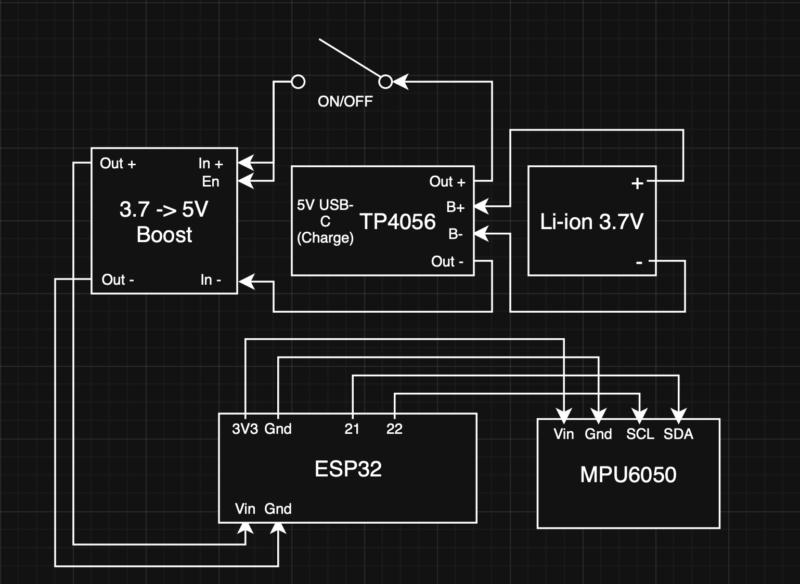
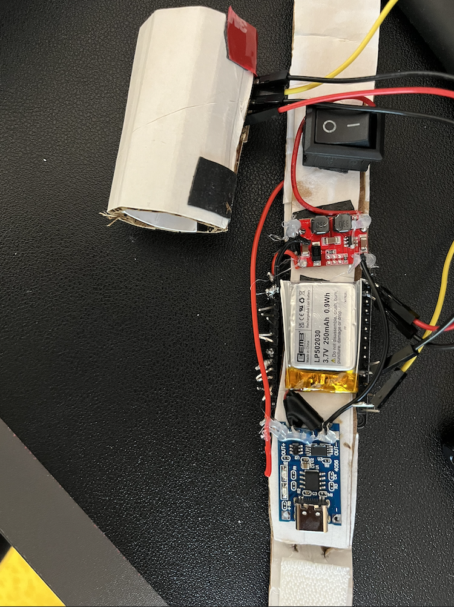
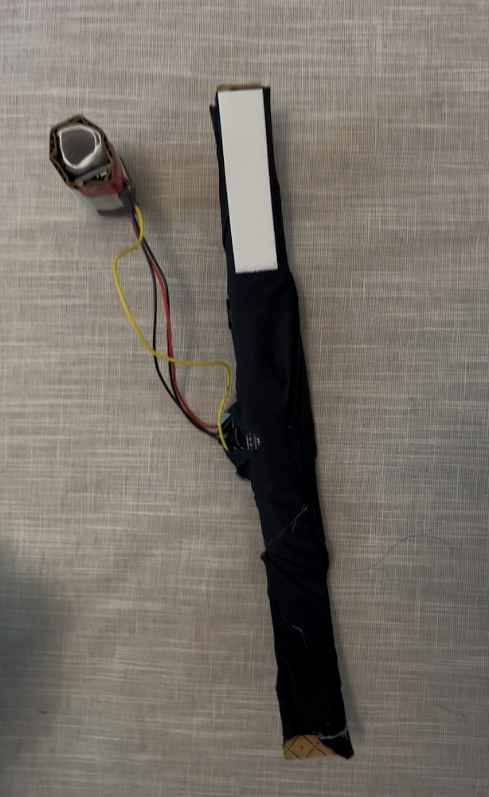

# FingerPointer: Gesture-Based Mouse Controller

## Overview
This project uses an ESP32 and MPU6050 to create a gesture-controlled BLE mouse.

## Parts List

### Hardware
- ESP32 Dev Board
- MPU6050 Accelerometer/Gyro
- TP4056 Charging Module
- EEMB 3.7V 502030 Li-ion Battery
- Rocker Switch
- Boost Converter (5V)
- Wires

### Libraries
- [BleMouse](https://github.com/T-vK/ESP32-BLE-Mouse)
- [MPU6050_light](https://github.com/rfetick/MPU6050_light)

## Wiring Diagram

## Hardware

## Finished Product

## How to Upload
1. Open `FingerPointer.ino` in Arduino IDE
2. Select board: **ESP32 Dev Module**
3. Install required libraries
4. Upload and test

## Gesture Controls
- Tilt and move finger → Move cursor
- Hold steady → Pause movement and enable gestures (such as click)
- Quick downward/forward flick when still → Gesture: Click